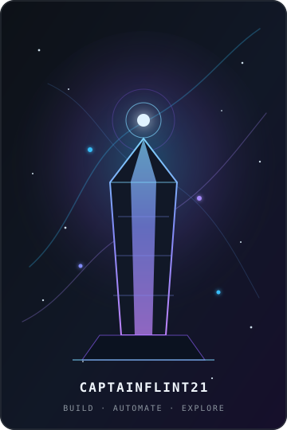

<table>
<tr>
<td width="66%" valign="top">

## 👋 Hi, I'm Flint — aka `CaptainFlint21`

**AI systems builder, automation engineer, product-minded developer.**

I build practical tools where AI, data, infrastructure, and interfaces meet: autonomous workflows, event-driven services, dashboards, developer tooling, and experimental Web3 products.

**System-first engineering. Useful automation. Products that actually run.**

<br>


</td>
<td width="34%" align="center" valign="top">



</td>
</tr>
</table>

---

## ⚙️ What I work with

```text
🤖 AI & agents      OpenAI API · Codex · Claude · Hermes · prompt systems
🧠 Automation       event-driven workflows · Telegram bots · scheduled agents
🧩 Product          React · Vite · TypeScript · Node.js · Express
🗄️ Data             PostgreSQL · Supabase · Drizzle ORM · ETL · dashboards
🐍 Backend           Python · asyncio · aiohttp · REST APIs · parsers
☁️ Infrastructure   Railway · Netlify · Docker · Linux · GitHub Actions
⛓️ Web3             Base · ERC-1155 · Pyth Entropy · wallet integrations
```

---

## 🚀 Selected work

<table>
<tr>
<td width="50%" valign="top">

### 🎮 [Tower of Entropy](https://github.com/CaptainFlint21/Tower-of-Entropy)

Hybrid Web3 RPG on **Base mainnet** with wallet authentication, ERC-1155 Genesis Packs, off-chain progression, and entropy-driven game mechanics.

`React` `TypeScript` `Node.js` `PostgreSQL` `Pyth`

🌐 [Live project](https://toegame.tech/)

</td>
<td width="50%" valign="top">

### 🧠 EntropyOS

Personal AI operating system for tasks, schedules, notes, Telegram workflows, autonomous agents, and durable project memory.

`AI agents` `Telegram` `Supabase` `Railway` `Automation`

</td>
</tr>
<tr>
<td width="50%" valign="top">

### 📊 ShotUp

Parser and private analytics dashboard for prediction-card data, with verified exports, quality gates, runtime tooling, and a React interface.

`Python` `PostgreSQL` `Fastify` `React` `Data pipelines`

</td>
<td width="50%" valign="top">

### 🧰 [KISA Stack](https://github.com/CaptainFlint21/kisa-stack-v2)

A reusable vibe-coding stack for **Claude Code, Codex CLI, and Hermes**: shared skills, agent policies, hooks, deployment profiles, backup, and rollback.

`Agent tooling` `Codex` `Claude` `Hermes` `Shell`

</td>
</tr>
<tr>
<td width="50%" valign="top">

### 🌐 [ShardBrowser](https://github.com/CaptainFlint21/ShardBrowser)

Open-source browser workspace and launcher with profile isolation, proxy integration, automation APIs, and a bundled MCP interface.

`Rust` `Chromium` `Python SDK` `Node SDK` `MCP`

</td>
<td width="50%" valign="top">

### 🧪 [PromtFamily](https://github.com/CaptainFlint21/PromtFamily)

A structured collection of prompts and reusable AI workflows designed to work independently or as composable systems.

`Prompt engineering` `Research` `Content systems`

</td>
</tr>
</table>

---

## 🧭 Current focus

- Building reliable AI-agent workflows with memory, tools, and clear operational boundaries.
- Turning prototypes into deployable products with observable backends and maintainable data flows.
- Exploring game systems, automation interfaces, and human-in-the-loop AI products.

---

## 🛰️ Outside the terminal

I follow AI tooling, game systems, crypto infrastructure, product design, and the strange edge where automation becomes a usable product.

Native Russian speaker. English when necessary.

<p align="center">
  <a href="https://github.com/CaptainFlint21"></a>
  <a href="https://x.com/ByKenzo21"></a>
  <a href="https://toegame.tech/"></a>
</p>

<p align="center"><sub>Building systems that reduce manual work and make ambitious ideas operational.</sub></p>
